# Abys Agrivet System
> Generated by [`prisma-markdown`](https://github.com/samchon/prisma-markdown)

- [default](#default)

## default

```mermaid
erDiagram
"Invoice" {
  String _id PK
  String petOwnerId FK
  String petOwnerFirstName
  String petOwnerLastName
  String services
  Float totalAmount
  String paymentStatus
  String paymentMethod
  DateTime createdAt
  DateTime updatedAt
}
"ClinicVisitBooking" {
  String _id PK
  String doctorId FK
  String doctorFirstName
  String doctorLastName
  Int petId FK
  String petName
  String petOwnerId FK
  String petOwnerFirstName
  String petOwnerLastName
  BookingStatus status
  DateTime date
  String time
  String note
  String file "nullable"
  DateTime createdAt
  DateTime updatedAt
}
"DoctorAvailabilityForClinicVisit" {
  String _id PK
  String doctorId FK
  String doctorFirstName
  String doctorLastName
  Int dayOfWeek
  DateTime startTime
  DateTime endTime
  String createdBy "nullable"
  String updatedBy "nullable"
  DateTime createdAt
  DateTime updatedAt
}
"ClinicVisitBookingHistory" {
  String _id PK
}
"OnlineConsultationBooking" {
  String _id PK
  Int petId FK
  String petName
  String petOwnerId FK
  String petOwnerFirstName
  String petOwnerLastName
  String doctorId FK "nullable"
  String doctorFirstName "nullable"
  String doctorLastName "nullable"
  String googleMeetLink "nullable"
  String googleCalendarEventId "nullable"
  BookingStatus status
  DateTime date
  DateTime startTime
  DateTime endTime
  String note "nullable"
  String file "nullable"
  String createdBy "nullable"
  String updatedBy "nullable"
  DateTime createdAt
  DateTime updatedAt
}
"DoctorAvailabilityForOnlineConsultation" {
  String _id PK
  String doctorId FK
  String doctorFirstName
  String doctorLastName
  Int dayOfWeek
  DateTime startTime
  DateTime endTime
  String createdBy "nullable"
  String updatedBy "nullable"
  DateTime createdAt
  DateTime updatedAt
}
"VaccinationBooking" {
  String _id PK
  String doctorIdAdministered FK "nullable"
  String doctorFirstNameAdministered "nullable"
  String doctorLastNameAdministered "nullable"
  String nurseIdAdministered FK "nullable"
  String nurseFirstNameAdministered "nullable"
  String nurseLastNameAdministered "nullable"
  Int petId FK
  String petName
  String petOwnerId FK
  String petOwnerFirstName
  String petOwnerLastName
  BookingStatus status
  DateTime date
  String time
  String vaccineNeeded
  String note "nullable"
  String vaccineBooklet
  String createdBy "nullable"
  String updatedBy "nullable"
  DateTime createdAt
  DateTime updatedAt
}
"AuditLog" {
  String _id PK
  String userId FK
  String userFirstName
  String userLastName
  String action
  String details
  DateTime createdAt
}
"EmailNotification" {
  String _id PK
  String userId FK
  String recipientEmail
  String recipientName
  String message
  String status
  DateTime createdAt
  DateTime updatedAt
}
"SMSNotification" {
  String messageId "nullable"
  String _id PK
  String userId FK
  String userEmail
  String recipient
  String message
  String sender_name
  String network
  String status
  String type
  String source
  DateTime createdAt
  DateTime updatedAt
}
"Antiparasitic" {
  String _id PK
  String createdByDoctorId FK "nullable"
  String createdByDoctorFirstName "nullable"
  String createdByDoctorLastName "nullable"
  String createdByNurseId FK "nullable"
  String createdByNurseFirstName "nullable"
  String createdByNurseLastName "nullable"
  String petOwnerId FK "nullable"
  String petOwnerFirstName "nullable"
  String petOwnerLastName "nullable"
  Int petId FK
  String petName
  String name
  DateTime dateAdministered
  Float petWeight
  String licenseNumber
  DateTime nextTreatmentDate "nullable"
  String note "nullable"
  String file "nullable"
  DateTime createdAt
  DateTime updatedAt
}
"LabResult" {
  String _id PK
  String createdByDoctorId FK "nullable"
  String createdByDoctorFirstName "nullable"
  String createdByDoctorLastName "nullable"
  String createdByNurseId FK "nullable"
  String createdByNurseFirstName "nullable"
  String createdByNurseLastName "nullable"
  String petOwnerId FK "nullable"
  String petOwnerFirstName "nullable"
  String petOwnerLastName "nullable"
  Int petId FK
  String petName
  String name
  DateTime datePerformed
  String note "nullable"
  String file
  DateTime createdAt
  DateTime updatedAt
}
"MedicalHistory" {
  String _id PK
  String createdByDoctorId FK "nullable"
  String createdByDoctorFirstName "nullable"
  String createdByDoctorLastName "nullable"
  String createdByNurseId FK "nullable"
  String createdByNurseFirstName "nullable"
  String createdByNurseLastName "nullable"
  String petOwnerId FK "nullable"
  String petOwnerFirstName "nullable"
  String petOwnerLastName "nullable"
  Int petId FK
  String petName
  String type
  DateTime date
  String note "nullable"
  String file
  DateTime createdAt
  DateTime updatedAt
}
"Medicine" {
  String _id PK
  String createdByDoctorId FK "nullable"
  String createdByDoctorFirstName "nullable"
  String createdByDoctorLastName "nullable"
  String createdByNurseId FK "nullable"
  String createdByNurseFirstName "nullable"
  String createdByNurseLastName "nullable"
  String petOwnerId FK "nullable"
  String petOwnerFirstName "nullable"
  String petOwnerLastName "nullable"
  Int petId FK
  String petName
  String name
  DateTime startDate
  DateTime endDate "nullable"
  String interval
  String dosage
  String note "nullable"
  String file "nullable"
  DateTime createdAt
  DateTime updatedAt
}
"Pet" {
  String _id PK
  String petOwnerId FK
  String petOwnerFirstName
  String petOwnerLastName
  Int petId UK
  String petName
  String petSex
  String petSpecies
  String petBreed
  DateTime petBirthdate
  String petAge
  String petColorAndMarkings "nullable"
  String petAvatar "nullable"
  DateTime createdAt
  DateTime updatedAt
}
"Prescription" {
  String _id PK
  String createdByDoctorId FK "nullable"
  String createdByDoctorFirstName "nullable"
  String createdByDoctorLastName "nullable"
  String createdByNurseId FK "nullable"
  String createdByNurseFirstName "nullable"
  String createdByNurseLastName "nullable"
  String petOwnerId FK "nullable"
  String petOwnerFirstName "nullable"
  String petOwnerLastName "nullable"
  Int petId FK
  String petName
  String name
  String licenseNumber
  String note "nullable"
  String file
  DateTime createdAt
  DateTime updatedAt
}
"SOAP" {
  String _id PK
  String createdByDoctorId FK
  String createdByDoctorFirstName
  String createdByDoctorLastName
  Int petId FK
  String petName
  String subjective
  String objective
  String assessment
  String plan
  DateTime createdAt
  DateTime updatedAt
}
"Vaccination" {
  String _id PK
  String createdByDoctorId FK "nullable"
  String createdByDoctorFirstName "nullable"
  String createdByDoctorLastName "nullable"
  String createdByDoctorLicenseNumber "nullable"
  String createdByNurseId FK "nullable"
  String createdByNurseFirstName "nullable"
  String createdByNurseLastName "nullable"
  String createdByNurseLicenseNumber "nullable"
  String petOwnerId FK "nullable"
  String petOwnerFirstName "nullable"
  String petOwnerLastName "nullable"
  Int petId FK
  String petName
  DateTime dateAdministered
  Float petWeight
  String vaccinationName
  String vaccinationAgainst
  DateTime nextVaccinationDate "nullable"
  String licenseNumber "nullable"
  String manufacturer "nullable"
  String lotNumber "nullable"
  String note "nullable"
  String file "nullable"
  DateTime createdAt
  DateTime updatedAt
}
"PetWeight" {
  String _id PK
  String createdByDoctorId FK "nullable"
  String createdByDoctorFirstName "nullable"
  String createdByDoctorLastName "nullable"
  String createdByNurseId FK "nullable"
  String createdByNurseFirstName "nullable"
  String createdByNurseLastName "nullable"
  String petOwnerId FK "nullable"
  String petOwnerFirstName "nullable"
  String petOwnerLastName "nullable"
  Int petId FK
  String petName
  Float weight
  DateTime createdAt
  DateTime updatedAt
}
"ClinicServiceRate" {
  String _id PK
  String petOwnerId FK
  String petOwnerFirstName
  String petOwnerLastName
  ClinicServices clinicService
  Float rating
  String review "nullable"
  DateTime createdAt
  DateTime updatedAt
}
"DoctorRating" {
  String _id PK
  String doctorId FK
  String doctorFirstName
  String doctorLastName
  String petOwnerId FK
  String petOwnerFirstName
  String petOwnerLastName
  Float rating
  String review "nullable"
  DateTime createdAt
  DateTime updatedAt
}
"AdminProfile" {
  String _id PK
  String adminUserId FK
  String adminFirstName
  String adminLastName
  Boolean sendEmail
  Boolean sendSMS
  DateTime createdAt
  DateTime updatedAt
}
"DoctorProfile" {
  String _id PK
  String doctorId FK
  String doctorFirstName
  String doctorLastName
  String title "nullable"
  String specializations
  Int yearsOfExperience "nullable"
  String qualifications
  String licenseNumber "nullable"
  String bio "nullable"
  String competencies
  String appointmentTypes
  Json testimonials
  String services
  String achievements
  DateTime createdAt
  DateTime updatedAt
}
"NurseProfile" {
  String _id PK
  String nurseId FK
  String nurseFirstName
  String nurseLastName
  String licenseNumber
  String title "nullable"
  String specializations
}
"PetOwnerProfile" {
  String _id PK
  String petOwnerId FK
  String petOwnerFirstName
  String petOwnerLastName
  DateTime createdAt
  DateTime updatedAt
}
"ReceptionistProfile" {
  String _id PK
  String receptionistUserId FK
  String receptionistFirstName
  String receptionistLastName
  DateTime createdAt
  DateTime updatedAt
}
"accounts" {
  String _id PK
  String userId FK
  String type
  String provider
  String providerAccountId
  String refresh_token "nullable"
  String access_token "nullable"
  Int expires_at "nullable"
  String token_type "nullable"
  String scope "nullable"
  String id_token "nullable"
  String session_state "nullable"
}
"sessions" {
  String _id PK
  String sessionToken UK
  String userId FK
  DateTime expires
}
"User" {
  String _id PK
  Int userId UK
  String firstName
  String lastName
  String phoneNumber "nullable"
  String sex "nullable"
  String address "nullable"
  DateTime birthDate "nullable"
  Int age "nullable"
  String email UK
  String password "nullable"
  DateTime emailVerified "nullable"
  String image "nullable"
  UserRole role
  UserStatus status
  Int failedAttempts "nullable"
  DateTime lockedUntil "nullable"
  Boolean isEmailVerified
  Int emailVerificationToken "nullable"
  DateTime emailVerificationTokenExpiry "nullable"
  String pwResetToken "nullable"
  DateTime pwResetTokenExpiry "nullable"
  DateTime createdAt
  DateTime updatedAt
}
"Invoice" }o--|| "PetOwnerProfile" : petOwner
"ClinicVisitBooking" }o--|| "DoctorProfile" : doctor
"ClinicVisitBooking" |o--|| "Pet" : pet
"ClinicVisitBooking" }o--|| "PetOwnerProfile" : petOwner
"DoctorAvailabilityForClinicVisit" }o--|| "DoctorProfile" : doctor
"OnlineConsultationBooking" |o--|| "Pet" : petPatient
"OnlineConsultationBooking" }o--|| "PetOwnerProfile" : petOwner
"OnlineConsultationBooking" }o--o| "DoctorProfile" : veterinarian
"DoctorAvailabilityForOnlineConsultation" }o--|| "DoctorProfile" : doctor
"VaccinationBooking" }o--o| "DoctorProfile" : doctor
"VaccinationBooking" }o--o| "NurseProfile" : nurse
"VaccinationBooking" |o--|| "Pet" : pet
"VaccinationBooking" }o--|| "PetOwnerProfile" : petOwner
"AuditLog" }o--|| "User" : user
"EmailNotification" }o--|| "User" : user
"SMSNotification" }o--|| "User" : user
"Antiparasitic" }o--o| "DoctorProfile" : createdByDoctor
"Antiparasitic" }o--o| "NurseProfile" : createdByNurse
"Antiparasitic" }o--o| "PetOwnerProfile" : createdByPetOwner
"Antiparasitic" |o--|| "Pet" : petPatient
"LabResult" }o--o| "DoctorProfile" : createdByDoctor
"LabResult" }o--o| "NurseProfile" : createdByNurse
"LabResult" }o--o| "PetOwnerProfile" : createdByPetOwner
"LabResult" |o--|| "Pet" : petPatient
"MedicalHistory" }o--o| "DoctorProfile" : createdByDoctor
"MedicalHistory" }o--o| "NurseProfile" : createdByNurse
"MedicalHistory" }o--o| "PetOwnerProfile" : createdByPetOwner
"MedicalHistory" |o--|| "Pet" : petPatient
"Medicine" }o--o| "DoctorProfile" : createdByDoctor
"Medicine" }o--o| "NurseProfile" : createdByNurse
"Medicine" }o--o| "PetOwnerProfile" : createdByPetOwner
"Medicine" |o--|| "Pet" : petPatient
"Pet" }o--|| "PetOwnerProfile" : petOwner
"Prescription" }o--o| "DoctorProfile" : createdByDoctor
"Prescription" }o--o| "NurseProfile" : createdByNurse
"Prescription" }o--o| "PetOwnerProfile" : createdByPetOwner
"Prescription" |o--|| "Pet" : petPatient
"SOAP" }o--|| "DoctorProfile" : createdByDoctor
"SOAP" |o--|| "Pet" : pet
"Vaccination" }o--o| "DoctorProfile" : createdByDoctor
"Vaccination" }o--o| "NurseProfile" : createdByNurse
"Vaccination" }o--o| "PetOwnerProfile" : createdByPetOwner
"Vaccination" |o--|| "Pet" : petPatient
"PetWeight" }o--o| "DoctorProfile" : createdByDoctor
"PetWeight" }o--o| "NurseProfile" : createdByNurse
"PetWeight" }o--o| "PetOwnerProfile" : cretedByPetOwner
"PetWeight" |o--|| "Pet" : pet
"ClinicServiceRate" }o--|| "PetOwnerProfile" : petOwner
"DoctorRating" }o--|| "DoctorProfile" : doctorProfile
"DoctorRating" }o--|| "PetOwnerProfile" : petOwner
"AdminProfile" }o--|| "User" : adminUser
"DoctorProfile" }o--|| "User" : doctorUser
"NurseProfile" }o--|| "User" : nurseUser
"PetOwnerProfile" }o--|| "User" : petOwnerUser
"ReceptionistProfile" }o--|| "User" : receptionistUser
"accounts" }o--|| "User" : user
"sessions" }o--|| "User" : user
```

### `Invoice`

**Properties**
  - `_id`: 
  - `petOwnerId`: 
  - `petOwnerFirstName`: 
  - `petOwnerLastName`: 
  - `services`: 
  - `totalAmount`: 
  - `paymentStatus`: 
  - `paymentMethod`: 
  - `createdAt`: 
  - `updatedAt`: 

### `ClinicVisitBooking`

**Properties**
  - `_id`: 
  - `doctorId`: 
  - `doctorFirstName`: 
  - `doctorLastName`: 
  - `petId`: 
  - `petName`: 
  - `petOwnerId`: 
  - `petOwnerFirstName`: 
  - `petOwnerLastName`: 
  - `status`: 
  - `date`: 
  - `time`: 
  - `note`: 
  - `file`: 
  - `createdAt`: 
  - `updatedAt`: 

### `DoctorAvailabilityForClinicVisit`

**Properties**
  - `_id`: 
  - `doctorId`: 
  - `doctorFirstName`: 
  - `doctorLastName`: 
  - `dayOfWeek`: 
  - `startTime`: 
  - `endTime`: 
  - `createdBy`: 
  - `updatedBy`: 
  - `createdAt`: 
  - `updatedAt`: 

### `ClinicVisitBookingHistory`

**Properties**
  - `_id`: 

### `OnlineConsultationBooking`

**Properties**
  - `_id`: 
  - `petId`: 
  - `petName`: 
  - `petOwnerId`: 
  - `petOwnerFirstName`: 
  - `petOwnerLastName`: 
  - `doctorId`: 
  - `doctorFirstName`: 
  - `doctorLastName`: 
  - `googleMeetLink`: 
  - `googleCalendarEventId`: 
  - `status`: 
  - `date`: 
  - `startTime`: 
  - `endTime`: 
  - `note`: 
  - `file`: 
  - `createdBy`: 
  - `updatedBy`: 
  - `createdAt`: 
  - `updatedAt`: 

### `DoctorAvailabilityForOnlineConsultation`

**Properties**
  - `_id`: 
  - `doctorId`: 
  - `doctorFirstName`: 
  - `doctorLastName`: 
  - `dayOfWeek`: 
  - `startTime`: 
  - `endTime`: 
  - `createdBy`: 
  - `updatedBy`: 
  - `createdAt`: 
  - `updatedAt`: 

### `VaccinationBooking`

**Properties**
  - `_id`: 
  - `doctorIdAdministered`: 
  - `doctorFirstNameAdministered`: 
  - `doctorLastNameAdministered`: 
  - `nurseIdAdministered`: 
  - `nurseFirstNameAdministered`: 
  - `nurseLastNameAdministered`: 
  - `petId`: 
  - `petName`: 
  - `petOwnerId`: 
  - `petOwnerFirstName`: 
  - `petOwnerLastName`: 
  - `status`: 
  - `date`: 
  - `time`: 
  - `vaccineNeeded`: 
  - `note`: 
  - `vaccineBooklet`: 
  - `createdBy`: 
  - `updatedBy`: 
  - `createdAt`: 
  - `updatedAt`: 

### `AuditLog`

**Properties**
  - `_id`: 
  - `userId`: 
  - `userFirstName`: 
  - `userLastName`: 
  - `action`: 
  - `details`: 
  - `createdAt`: 

### `EmailNotification`

**Properties**
  - `_id`: 
  - `userId`: 
  - `recipientEmail`: 
  - `recipientName`: 
  - `message`: 
  - `status`: 
  - `createdAt`: 
  - `updatedAt`: 

### `SMSNotification`

**Properties**
  - `messageId`: 
  - `_id`: 
  - `userId`: 
  - `userEmail`: 
  - `recipient`: 
  - `message`: 
  - `sender_name`: 
  - `network`: 
  - `status`: 
  - `type`: 
  - `source`: 
  - `createdAt`: 
  - `updatedAt`: 

### `Antiparasitic`

**Properties**
  - `_id`: 
  - `createdByDoctorId`: 
  - `createdByDoctorFirstName`: 
  - `createdByDoctorLastName`: 
  - `createdByNurseId`: 
  - `createdByNurseFirstName`: 
  - `createdByNurseLastName`: 
  - `petOwnerId`: 
  - `petOwnerFirstName`: 
  - `petOwnerLastName`: 
  - `petId`: 
  - `petName`: 
  - `name`: 
  - `dateAdministered`: 
  - `petWeight`: 
  - `licenseNumber`: 
  - `nextTreatmentDate`: 
  - `note`: 
  - `file`: 
  - `createdAt`: 
  - `updatedAt`: 

### `LabResult`

**Properties**
  - `_id`: 
  - `createdByDoctorId`: 
  - `createdByDoctorFirstName`: 
  - `createdByDoctorLastName`: 
  - `createdByNurseId`: 
  - `createdByNurseFirstName`: 
  - `createdByNurseLastName`: 
  - `petOwnerId`: 
  - `petOwnerFirstName`: 
  - `petOwnerLastName`: 
  - `petId`: 
  - `petName`: 
  - `name`: 
  - `datePerformed`: 
  - `note`: 
  - `file`: 
  - `createdAt`: 
  - `updatedAt`: 

### `MedicalHistory`

**Properties**
  - `_id`: 
  - `createdByDoctorId`: 
  - `createdByDoctorFirstName`: 
  - `createdByDoctorLastName`: 
  - `createdByNurseId`: 
  - `createdByNurseFirstName`: 
  - `createdByNurseLastName`: 
  - `petOwnerId`: 
  - `petOwnerFirstName`: 
  - `petOwnerLastName`: 
  - `petId`: 
  - `petName`: 
  - `type`: 
  - `date`: 
  - `note`: 
  - `file`: 
  - `createdAt`: 
  - `updatedAt`: 

### `Medicine`

**Properties**
  - `_id`: 
  - `createdByDoctorId`: 
  - `createdByDoctorFirstName`: 
  - `createdByDoctorLastName`: 
  - `createdByNurseId`: 
  - `createdByNurseFirstName`: 
  - `createdByNurseLastName`: 
  - `petOwnerId`: 
  - `petOwnerFirstName`: 
  - `petOwnerLastName`: 
  - `petId`: 
  - `petName`: 
  - `name`: 
  - `startDate`: 
  - `endDate`: 
  - `interval`: 
  - `dosage`: 
  - `note`: 
  - `file`: 
  - `createdAt`: 
  - `updatedAt`: 

### `Pet`

**Properties**
  - `_id`: 
  - `petOwnerId`: 
  - `petOwnerFirstName`: 
  - `petOwnerLastName`: 
  - `petId`: 
  - `petName`: 
  - `petSex`: 
  - `petSpecies`: 
  - `petBreed`: 
  - `petBirthdate`: 
  - `petAge`: 
  - `petColorAndMarkings`: 
  - `petAvatar`: 
  - `createdAt`: 
  - `updatedAt`: 

### `Prescription`

**Properties**
  - `_id`: 
  - `createdByDoctorId`: 
  - `createdByDoctorFirstName`: 
  - `createdByDoctorLastName`: 
  - `createdByNurseId`: 
  - `createdByNurseFirstName`: 
  - `createdByNurseLastName`: 
  - `petOwnerId`: 
  - `petOwnerFirstName`: 
  - `petOwnerLastName`: 
  - `petId`: 
  - `petName`: 
  - `name`: 
  - `licenseNumber`: 
  - `note`: 
  - `file`: 
  - `createdAt`: 
  - `updatedAt`: 

### `SOAP`

**Properties**
  - `_id`: 
  - `createdByDoctorId`: 
  - `createdByDoctorFirstName`: 
  - `createdByDoctorLastName`: 
  - `petId`: 
  - `petName`: 
  - `subjective`: 
  - `objective`: 
  - `assessment`: 
  - `plan`: 
  - `createdAt`: 
  - `updatedAt`: 

### `Vaccination`

**Properties**
  - `_id`: 
  - `createdByDoctorId`: 
  - `createdByDoctorFirstName`: 
  - `createdByDoctorLastName`: 
  - `createdByDoctorLicenseNumber`: 
  - `createdByNurseId`: 
  - `createdByNurseFirstName`: 
  - `createdByNurseLastName`: 
  - `createdByNurseLicenseNumber`: 
  - `petOwnerId`: 
  - `petOwnerFirstName`: 
  - `petOwnerLastName`: 
  - `petId`: 
  - `petName`: 
  - `dateAdministered`: 
  - `petWeight`: 
  - `vaccinationName`: 
  - `vaccinationAgainst`: 
  - `nextVaccinationDate`: 
  - `licenseNumber`: 
  - `manufacturer`: 
  - `lotNumber`: 
  - `note`: 
  - `file`: 
  - `createdAt`: 
  - `updatedAt`: 

### `PetWeight`

**Properties**
  - `_id`: 
  - `createdByDoctorId`: 
  - `createdByDoctorFirstName`: 
  - `createdByDoctorLastName`: 
  - `createdByNurseId`: 
  - `createdByNurseFirstName`: 
  - `createdByNurseLastName`: 
  - `petOwnerId`: 
  - `petOwnerFirstName`: 
  - `petOwnerLastName`: 
  - `petId`: 
  - `petName`: 
  - `weight`: 
  - `createdAt`: 
  - `updatedAt`: 

### `ClinicServiceRate`

**Properties**
  - `_id`: 
  - `petOwnerId`: 
  - `petOwnerFirstName`: 
  - `petOwnerLastName`: 
  - `clinicService`: 
  - `rating`: 
  - `review`: 
  - `createdAt`: 
  - `updatedAt`: 

### `DoctorRating`

**Properties**
  - `_id`: 
  - `doctorId`: 
  - `doctorFirstName`: 
  - `doctorLastName`: 
  - `petOwnerId`: 
  - `petOwnerFirstName`: 
  - `petOwnerLastName`: 
  - `rating`: 
  - `review`: 
  - `createdAt`: 
  - `updatedAt`: 

### `AdminProfile`

**Properties**
  - `_id`: 
  - `adminUserId`: 
  - `adminFirstName`: 
  - `adminLastName`: 
  - `sendEmail`: 
  - `sendSMS`: 
  - `createdAt`: 
  - `updatedAt`: 

### `DoctorProfile`

**Properties**
  - `_id`: 
  - `doctorId`: 
  - `doctorFirstName`: 
  - `doctorLastName`: 
  - `title`: 
  - `specializations`: 
  - `yearsOfExperience`: 
  - `qualifications`: 
  - `licenseNumber`: 
  - `bio`: 
  - `competencies`: 
  - `appointmentTypes`: 
  - `testimonials`: 
  - `services`: 
  - `achievements`: 
  - `createdAt`: 
  - `updatedAt`: 

### `NurseProfile`

**Properties**
  - `_id`: 
  - `nurseId`: 
  - `nurseFirstName`: 
  - `nurseLastName`: 
  - `licenseNumber`: 
  - `title`: 
  - `specializations`: 

### `PetOwnerProfile`

**Properties**
  - `_id`: 
  - `petOwnerId`: 
  - `petOwnerFirstName`: 
  - `petOwnerLastName`: 
  - `createdAt`: 
  - `updatedAt`: 

### `ReceptionistProfile`

**Properties**
  - `_id`: 
  - `receptionistUserId`: 
  - `receptionistFirstName`: 
  - `receptionistLastName`: 
  - `createdAt`: 
  - `updatedAt`: 

### `accounts`

**Properties**
  - `_id`: 
  - `userId`: 
  - `type`: 
  - `provider`: 
  - `providerAccountId`: 
  - `refresh_token`: 
  - `access_token`: 
  - `expires_at`: 
  - `token_type`: 
  - `scope`: 
  - `id_token`: 
  - `session_state`: 

### `sessions`

**Properties**
  - `_id`: 
  - `sessionToken`: 
  - `userId`: 
  - `expires`: 

### `User`

**Properties**
  - `_id`: 
  - `userId`: 
  - `firstName`: 
  - `lastName`: 
  - `phoneNumber`: 
  - `sex`: 
  - `address`: 
  - `birthDate`: 
  - `age`: 
  - `email`: 
  - `password`: 
  - `emailVerified`: 
  - `image`: 
  - `role`: 
  - `status`: 
  - `failedAttempts`: 
  - `lockedUntil`: 
  - `isEmailVerified`: 
  - `emailVerificationToken`: 
  - `emailVerificationTokenExpiry`: 
  - `pwResetToken`: 
  - `pwResetTokenExpiry`: 
  - `createdAt`: 
  - `updatedAt`: 